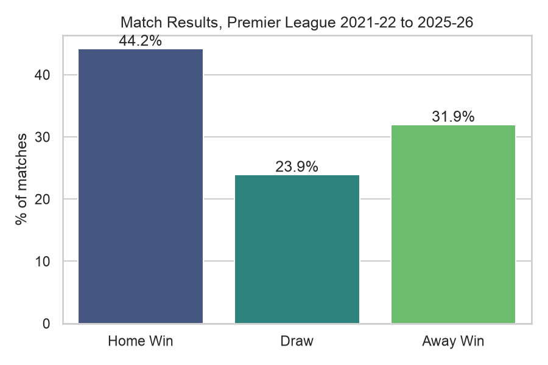
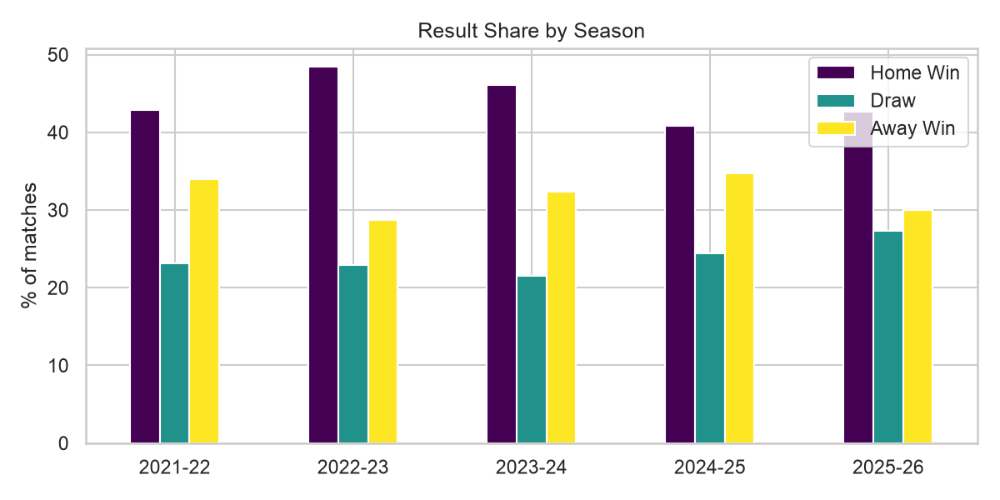
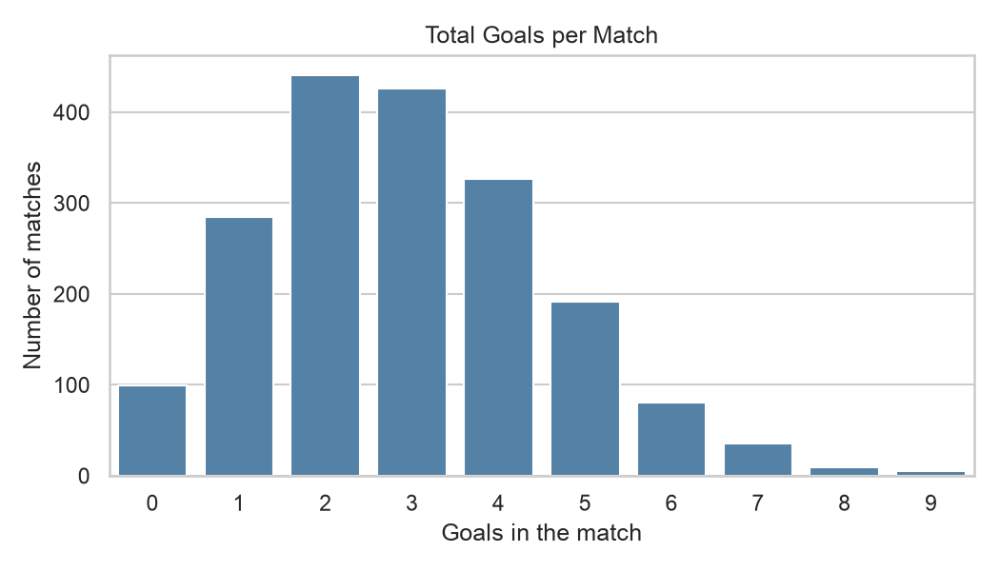
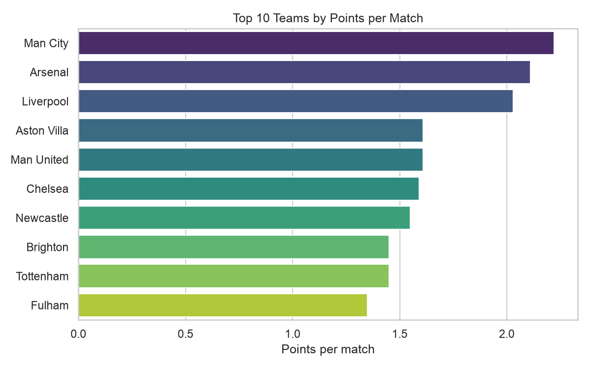
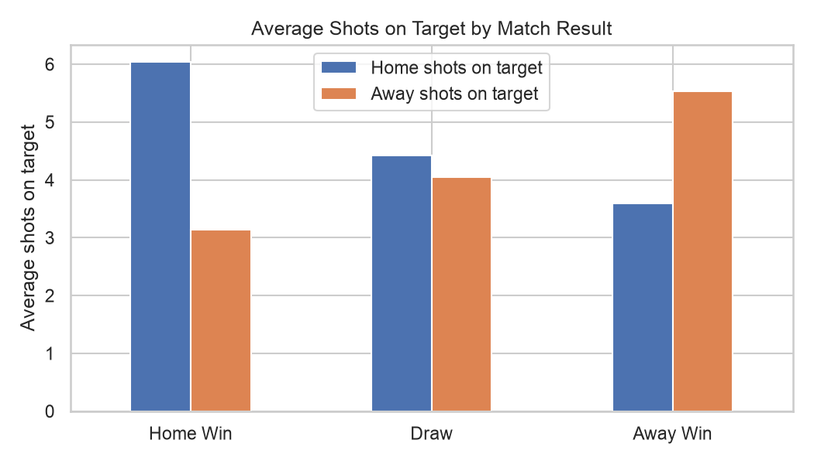
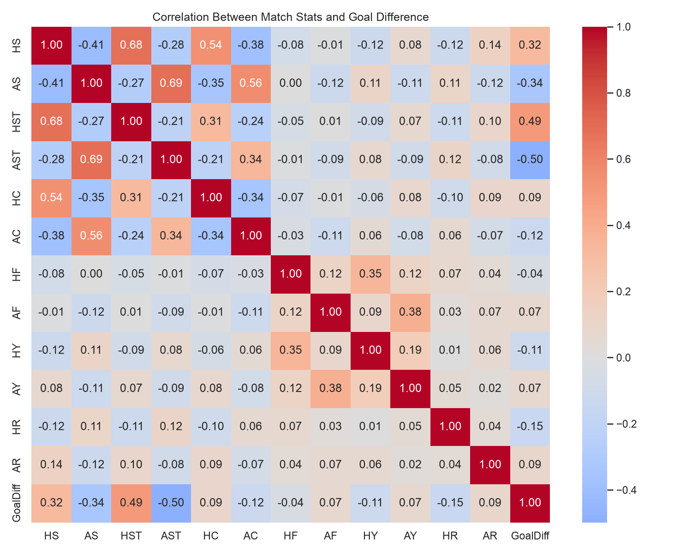
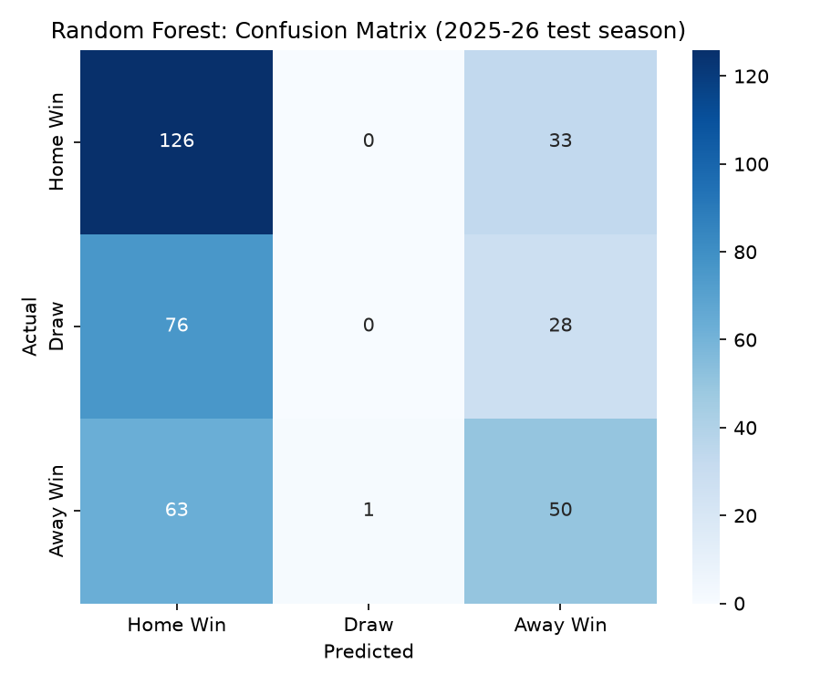
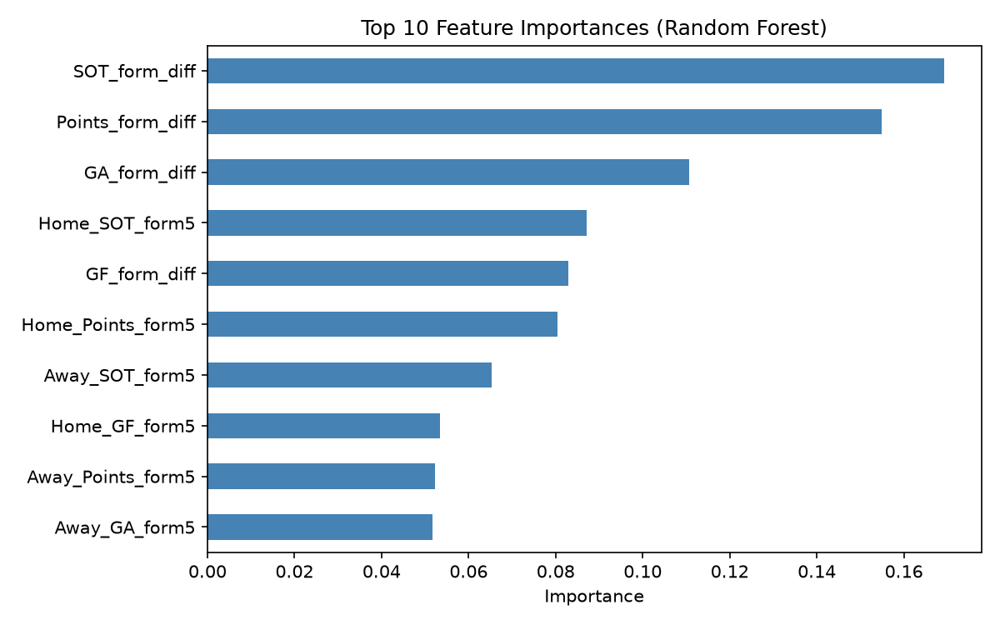

# Football Match Analysis & Outcome Prediction

An end-to-end data analysis project on 1,900 Premier League matches (2021-22 to 2025-26): data cleaning, exploratory analysis, feature engineering, and a machine learning model that predicts match results from recent team form.

## Questions
1. How big is home advantage, and is it stable across seasons?
2. Which teams performed best over this period?
3. Can a team's recent form alone predict the result of a match?

## Key Findings

- **Home advantage is real.** Home teams won 44.2% of matches, away teams 31.9%, and 23.9% ended in a draw.
- **It is not constant.** The home win rate ranged from 40.8% (2024-25) to 48.4% (2022-23), with no clear upward or downward trend.
- **Matches average 2.93 goals.**
- **Top teams by points per match:** Man City (2.22), Arsenal (2.11) and Liverpool (2.03).

| Result split | Home advantage by season |
|---|---|
|  |  |

| Goals per match | Top teams |
|---|---|
|  |  |

| Shots on target vs result | Correlation heatmap |
|---|---|
|  |  |

## Modeling

**Goal:** predict Home Win / Draw / Away Win using only information available before kick-off.

**Features:** rolling averages over each team's previous 5 matches (goals scored, goals conceded, points, shots on target), plus home-minus-away differences. Features use `shift(1)`, so a match never sees its own result (no data leakage).

**Split:** trained on 2021-22 to 2024-25, tested on the 2025-26 season (377 matches). The split is by time, not random, because football matches should not be predicted using future results.

| Model | Accuracy |
|---|---|
| Baseline (always predict home win) | 0.422 |
| Logistic Regression | 0.446 |
| Random Forest | 0.467 |

**Random Forest, per-class results**

| Result | Precision | Recall |
|---|---|---|
| Home Win | 0.48 | 0.79 |
| Draw | 0.00 | 0.00 |
| Away Win | 0.45 | 0.44 |

The most important features were the difference in recent shots-on-target form, the difference in recent points form, and the difference in recent goals conceded.

| Confusion matrix | Feature importance |
|---|---|
|  |  |

### Honest reading of the results
- The Random Forest got about 17 more matches right than the baseline out of 377. That is a modest gain, and with a single test season it is not strong evidence of a reliable edge.
- The model **never predicts a draw** (recall 0.00). Draws are the hardest outcome to predict from form alone, and the model leans toward home wins (recall 0.79).

## Limitations and next steps
- One test season only; cross-validation across seasons would give a steadier estimate.
- Form uses only the last 5 matches; longer windows, opponent strength and home/away splits could help.
- No player, injury, lineup or schedule data.
- Try class weighting or probability thresholds so the model can predict draws.

## Project Structure
```
football-analysis/
├── data/
│   ├── raw/          # Premier League CSVs, one per season
│   └── processed/    # cleaned data and model-ready features
├── notebooks/
│   ├── 01_data_loading.ipynb
│   ├── 02_data_cleaning.ipynb
│   ├── 03_eda.ipynb
│   ├── 04_features.ipynb
│   └── 05_modeling.ipynb
├── src/
│   └── summary_stats.py   # prints the numbers quoted in this README
├── images/               # charts
└── requirements.txt
```

## How to Run
```bash
git clone https://github.com/s17hann/football-analysis.git
cd football-analysis
python3 -m venv venv
source venv/bin/activate
pip3 install -r requirements.txt
jupyter notebook  
python3 src/summary_stats.py
```

## Tools
Python, pandas, NumPy, matplotlib, seaborn, scikit-learn, Jupyter

## Data
Match data from [football-data.co.uk](https://www.football-data.co.uk/).